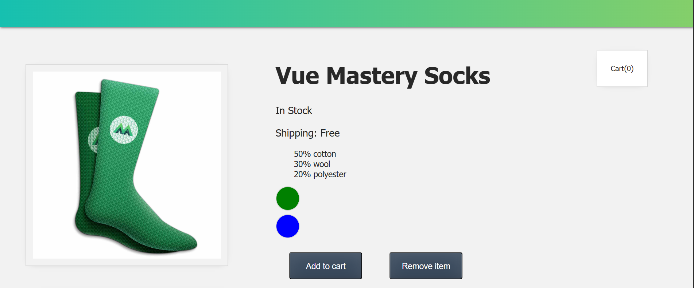

# Getting-Started-With-VueJs

This project is based on the **VueMastery - Introduction to Vue.js** course and serves as a hands-on learning exercise.

📸 **Preview**
<br>


---

© Copyrights belong to [VueMastery](https://www.vuemastery.com/) — *Introduction to Vue.js* course.<br>
🟢 Live Demo: [https://getting-started-with-vuejs.netlify.app/](https://getting-started-with-vuejs.netlify.app/)

## Recommended IDE Setup

[VSCode](https://code.visualstudio.com/) + [Volar](https://marketplace.visualstudio.com/items?itemName=Vue.volar) (and disable Vetur) + [TypeScript Vue Plugin (Volar)](https://marketplace.visualstudio.com/items?itemName=Vue.vscode-typescript-vue-plugin).

## Customize configuration

See [Vite Configuration Reference](https://vitejs.dev/config/).

## Project Setup

```sh
npm install
```

### Compile and Hot-Reload for Development

```sh
npm run dev
```

### Compile and Minify for Production

```sh
npm run build
```
